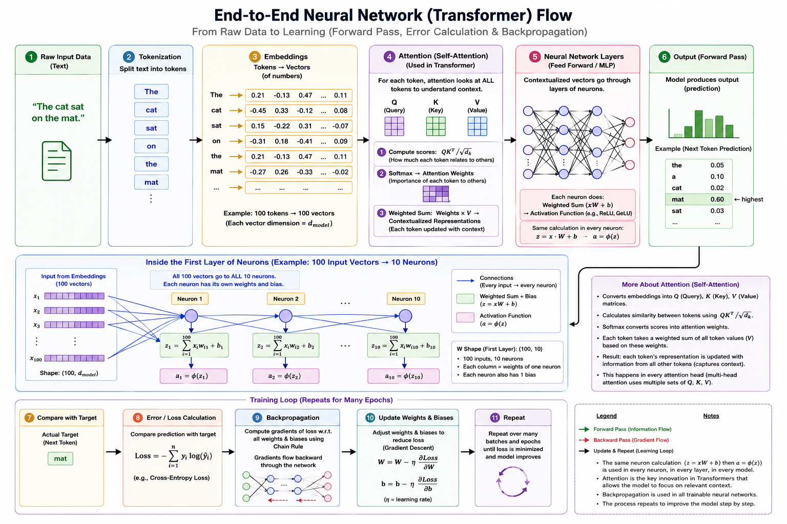
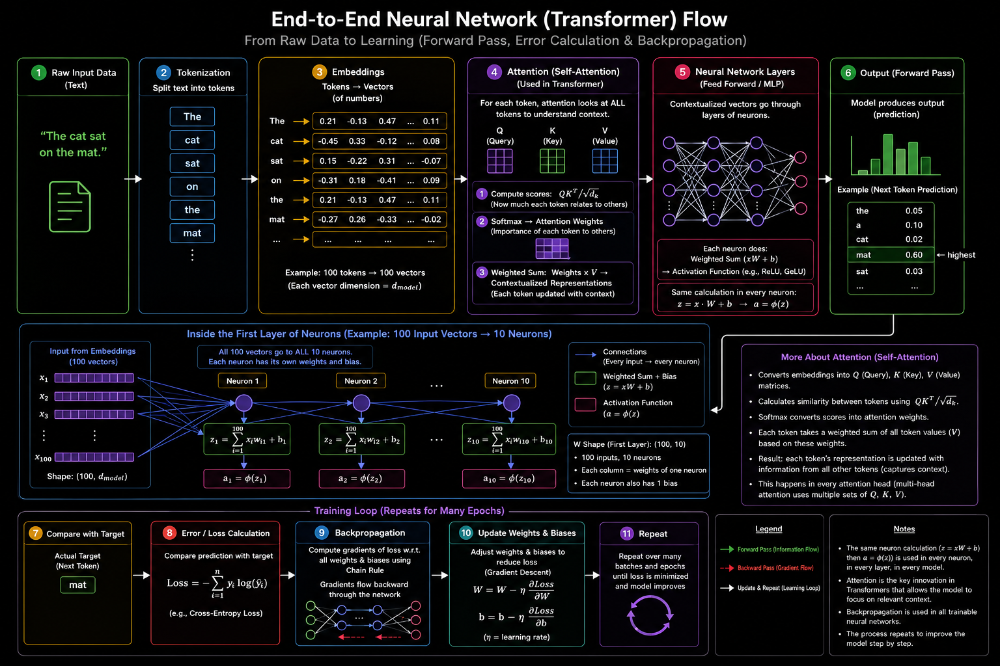

# Neural Network Common Architecture

## Goal

This folder stores the common neural-network architecture references used across the learning lab.

The purpose is to keep the big-picture mental model visible before going into code:

- raw data becomes tokens
- tokens become numeric vectors
- vectors move through layers
- layers produce scores
- scores become probabilities
- predictions are compared with expected output
- loss produces gradients
- gradients update weights and biases

This is the foundation for the email classifier, the Gita embedding model, the tiny transformer, the RAG assistant, and the visualizer.

## Architecture Images

### End-to-End Neural Network / Transformer Flow



### Additional High-Level Architecture Reference



## What These Diagrams Teach

The diagrams explain the complete learning loop:

```text
Raw input
-> tokenization
-> embedding/vectorization
-> neural network layers
-> output scores
-> softmax probabilities
-> prediction
-> compare with target
-> loss
-> backpropagation
-> weight and bias update
-> repeat
```

## Core Concepts

### Tokenization

Tokenization means splitting input text into smaller pieces that the model can process.

For Phase 1, tokenization is simple word tokenization:

```text
"Can we review the project deadline tomorrow?"
-> ["can", "we", "review", "the", "project", "deadline", "tomorrow"]
```

For transformer-style models, tokenization becomes more important because the model predicts the next token from a fixed vocabulary.

### Vocabulary

Vocabulary means the set of known tokens.

It is not the input data itself. It is the list of unique tokens the model knows how to map to numbers.

Example:

```text
["can", "we", "review", "project", "deadline", "offer", "spam"]
```

In a classifier, the output layer size equals the number of classes.

In a next-token transformer, the output layer size equals the vocabulary size, because the model must score every possible next token.

### Vectorization and Embeddings

Vectorization converts text into numbers.

Examples:

- Bag-of-Words vector for the Phase 1 email classifier.
- Learned neural embedding vector for the Gita retrieval model.
- Token embedding vectors for transformer learning.

Important learning point:

```text
One token can be represented by one vector.
That vector can have many dimensions.
```

Example:

```text
token: anger
vector: [0.21, -0.13, 0.47, 0.08, -0.31]
```

### Hidden Layers

A hidden layer applies:

```text
Z = XW + b
A = activation(Z)
```

For Phase 1:

```text
Input vector size: 1000
Hidden layer: 32 neurons
Output layer: 4 neurons
```

The 4 output neurons exist because the email classifier has 4 classes:

```text
work
personal
promotion
spam
```

### Transformer Output Layer

For a GPT-style transformer, the last layer has one output score per vocabulary token.

If the vocabulary has 50,000 tokens:

```text
output layer size = 50,000
```

This is because the transformer predicts:

```text
What is the next token?
```

It can only choose from the vocabulary it was built/trained with.

### Loss and Backpropagation

Loss measures how wrong the prediction was.

Backpropagation calculates how each weight and bias contributed to the error.

Gradient descent updates them:

```text
W = W - learning_rate * dW
b = b - learning_rate * db
```

This is how training changes the model.

## Requirements

No runtime requirement is needed for this folder.

To view the images:

- open the PNG files directly
- or view this README in GitHub, VS Code, or another Markdown viewer

## How To Use This Folder

Use this folder before starting or explaining any phase:

1. Start with the full data flow.
2. Identify which part the current model implements.
3. Compare the simple classifier flow with the transformer flow.
4. Use the same language in code comments, READMEs, UI labels, and visualizer boxes.

## Relationship To Other Folders

```text
00_neural_network_common_architecture
  -> concepts and diagrams

01_foundational_neural_network
  -> builds the first classifier from scratch

02_gita_ai_models
  -> builds retrieval, embedding, RAG, and transformer experiments

model_flow_visualizer
  -> turns these concepts into an interactive visual learning UI
```
