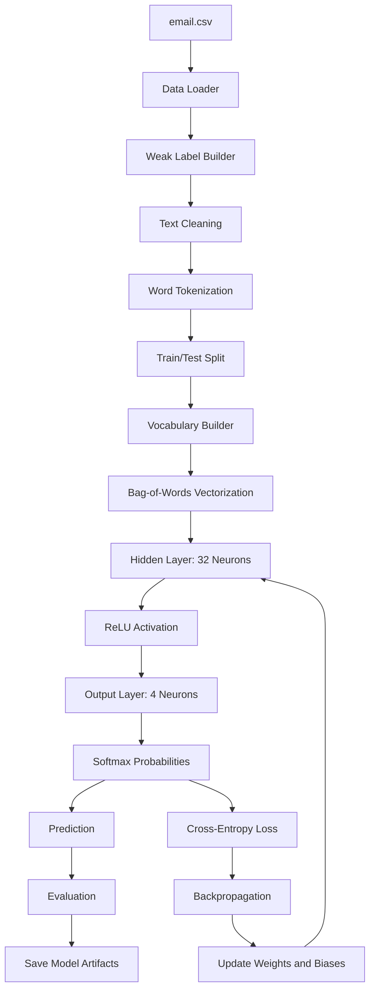

# 01 Foundational Neural Network

## Goal

Build the first neural network from scratch and understand every step of training.

The model classifies an email or message into one of four categories:

```text
work
personal
promotion
spam
```

The main purpose is learning, not only accuracy. This phase teaches how text becomes numbers, how a neural network calculates predictions, how loss is calculated, and how backpropagation updates weights and biases.

## Model

```text
dpp-email-classifier-small-v1
```

Meaning:

```text
dpp = Debi Prasad Pradhan
email-classifier = task
small = compact local model
v1 = first version
```

## Functionality

This folder can:

- load `email.csv`
- build four training labels from the source email data
- tokenize text
- build a vocabulary
- convert messages to Bag-of-Words vectors
- train a NumPy neural network from scratch
- run forward propagation
- calculate softmax probabilities
- calculate cross-entropy loss
- run backpropagation
- update weights and biases with gradient descent
- evaluate on a 90 percent training / 10 percent testing split
- export model artifacts
- predict from the command line
- expose the model through a small SDK
- inspect forward pass and training-step internals

## Technical Details

### Dataset

Input file:

```text
email.csv
```

Original labels:

```text
ham
spam
```

Target labels:

```text
work
personal
promotion
spam
```

Because the original dataset does not contain all four target classes, this phase uses weak labeling.

### Label Builder

```text
if original label is spam:
    target = spam
else if ham text contains work keywords:
    target = work
else if ham text contains promotion keywords:
    target = promotion
else:
    target = personal
```

This is intentionally simple. It lets us learn the full supervised training loop while accepting that label quality is not perfect.

### Tokenization

Algorithm:

```text
lowercase
regex cleanup
word-level tokenization
```

Example:

```text
"Can we review the project deadline tomorrow?"
-> ["can", "we", "review", "the", "project", "deadline", "tomorrow"]
```

### Vectorization

Algorithm:

```text
Bag-of-Words count vector
```

Vocabulary size:

```text
1000 words
```

Each message becomes:

```text
1 x 1000 vector
```

### Neural Network Shape

```text
Input layer: 1000 features
Hidden layer: 32 neurons
Output layer: 4 neurons
```

Output neurons:

```text
Neuron 1 -> work
Neuron 2 -> personal
Neuron 3 -> promotion
Neuron 4 -> spam
```

### Forward Propagation

```text
Z1 = XW1 + b1
A1 = ReLU(Z1)
Z2 = A1W2 + b2
A2 = Softmax(Z2)
```

### Training

Loss:

```text
cross-entropy
```

Weight update:

```text
batch gradient descent
```

Backpropagation calculates:

```text
dZ2, dW2, db2
dA1, dZ1, dW1, db1
```

## Architecture



## Folder Structure

```text
01_foundational_neural_network/
  email.csv
  train_email_classifier.py
  predict.py
  inspect_forward.py
  inspect_training_step.py
  run_all_tests.py
  requirements.txt
  design.md
  execution_plan.md
  src/
    data.py
    labels.py
    text.py
    features.py
    model.py
    train.py
    evaluate.py
    storage.py
  sdk/
    classifier.py
  models/
    dpp-email-classifier-small-v1/
      model.npz
      vocabulary.json
      labels.json
      model_card.json
  tests/
```

## Requirements

Python dependencies:

```text
numpy
```

Install:

```bash
cd /Users/debi.pradhan/Documents/ML/01_foundational_neural_network
python3 -m pip install -r requirements.txt
```

## How To Setup

```bash
cd /Users/debi.pradhan/Documents/ML/01_foundational_neural_network
python3 -m pip install -r requirements.txt
```

The dataset is already included:

```text
email.csv
```

## How To Execute

Train the model:

```bash
cd /Users/debi.pradhan/Documents/ML/01_foundational_neural_network
python3 train_email_classifier.py
```

Run a prediction:

```bash
python3 predict.py "Can we review the project deadline tomorrow?"
```

Inspect a forward pass:

```bash
python3 inspect_forward.py "Can we review the project deadline tomorrow?"
```

Inspect one training step:

```bash
python3 inspect_training_step.py "limited offer claim your reward today" promotion
```

Run tests:

```bash
python3 run_all_tests.py
```

## How Users Can Use It

Use the CLI:

```bash
python3 predict.py "Free prize claim now"
```

Use the SDK:

```python
from sdk.classifier import EmailClassifier

model = EmailClassifier.load("dpp-email-classifier-small-v1")
result = model.predict("Can we review the project tomorrow?")
print(result)
```

Use through the common API:

```bash
cd /Users/debi.pradhan/Documents/ML/common_model_api
uvicorn app:app --reload --port 8010
```

Then call:

```text
POST http://127.0.0.1:8010/predict
```

Example payload:

```json
{
  "model_id": "dpp-email-classifier-small-v1",
  "input": "Can we review the project deadline tomorrow?"
}
```

## Learning Notes

This phase answers the early questions:

- Why does the output layer have 4 neurons? Because there are 4 classes.
- Is vocabulary the same as input data? No. Vocabulary is the unique known tokens.
- What if vocabulary size is larger than the hidden layer? That is normal. The first weight matrix maps high-dimensional input features into a smaller hidden representation.
- Does testing update weights? No. Testing runs forward pass only and measures accuracy.
- Where are final weights stored? In `models/dpp-email-classifier-small-v1/model.npz`.

## Current Limitations

- Labels are weakly generated from a ham/spam dataset.
- The model uses Bag-of-Words, so it does not understand word order.
- This phase is for learning the neural network loop, not production-grade email classification.
