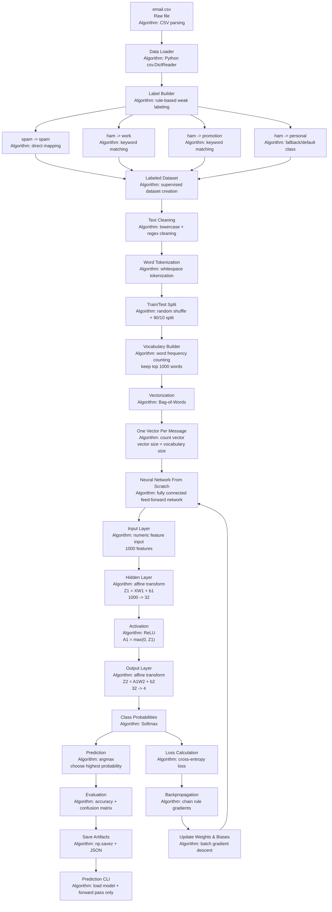

# Phase 1: Neural Network From Scratch

## Goal

Build a neural network from scratch to classify messages into four classes:

```text
work
personal
promotion
spam
```

We will use the existing `email.csv` dataset as the starting data source.

The main focus of Phase 1 is not just prediction. The focus is to understand and implement the full learning loop ourselves:

```text
text data -> numbers -> forward propagation -> loss -> backpropagation -> weight update -> prediction
```

## What We Are Targeting

By the end of Phase 1, we should be able to:

- Load `email.csv`.
- Convert the original `ham/spam` labels into four classes.
- Clean and tokenize each message.
- Build a vocabulary from the training data.
- Convert each message into a numeric vector.
- Train a two-layer neural network using NumPy.
- Implement forward propagation manually.
- Implement cross-entropy loss manually.
- Implement backpropagation manually.
- Update weights and biases using gradient descent.
- Evaluate on a 10% test split.
- Save the trained model and vocabulary.
- Predict a new message from the command line.

Example final command:

```bash
python 01_neural_net_from_scratch/predict.py "Can we review the project deadline tomorrow?"
```

Expected style of output:

```text
Prediction: work

Confidence:
work: 0.74
personal: 0.12
promotion: 0.08
spam: 0.06
```

## Dataset

Input file:

```text
../email.csv
```

Current dataset columns:

```text
Category, Message
```

Current labels:

```text
ham
spam
```

Target labels:

```text
work
personal
promotion
spam
```

Because the dataset only has `ham` and `spam`, we will create the extra labels using a simple rule-based label builder.

## Label Builder

The label builder creates the answer key for training.

Rules:

```text
if Category == spam:
    label = spam
else if ham message contains work keywords:
    label = work
else if ham message contains promotion keywords:
    label = promotion
else:
    label = personal
```

Initial work keywords:

```text
meeting, project, report, review, deadline, office, client, call, schedule, today, tomorrow, urgent
```

Initial promotion keywords:

```text
offer, free, prize, win, claim, discount, voucher, deal, ringtone, callertune, subscription
```

Note: this is weak labeling. It will not be perfect, but it is useful for learning the full neural network workflow.

## Model Shape

We will use a small fully connected neural network.

```text
Input layer: 1000 features
Hidden layer: 32 neurons
Output layer: 4 neurons
```

If the vocabulary size is 1000, each message becomes one vector with 1000 numbers.

```text
X shape: number_of_messages x 1000
```

The output layer has 4 neurons because the model must choose one of 4 possible labels.

```text
Neuron 1 -> work
Neuron 2 -> personal
Neuron 3 -> promotion
Neuron 4 -> spam
```

## Phase 1 Architecture



## Data Flow

```text
email.csv
  -> load rows
  -> build four-class labels
  -> clean text
  -> tokenize words
  -> split 90% train / 10% test
  -> build vocabulary from train data only
  -> vectorize messages with Bag-of-Words
  -> run neural network
  -> forward propagation
  -> calculate loss
  -> backpropagation
  -> update weights and biases
  -> evaluate on test data
  -> save model artifacts
  -> predict new messages
```

## Algorithms We Will Use

| Step | Algorithm |
| --- | --- |
| Data loading | CSV parsing with `csv.DictReader` |
| Label building | Rule-based weak labeling |
| Text cleaning | Lowercase + regex cleaning |
| Tokenization | Word-level whitespace tokenization |
| Train/test split | Random shuffle + 90/10 split |
| Vocabulary builder | Word frequency counting, keep top 1000 |
| Vectorization | Bag-of-Words count vector |
| Hidden layer | Affine transform, `Z1 = XW1 + b1` |
| Activation | ReLU, `A1 = max(0, Z1)` |
| Output layer | Affine transform, `Z2 = A1W2 + b2` |
| Probabilities | Softmax |
| Loss | Cross-entropy |
| Backpropagation | Chain rule gradients |
| Weight update | Batch gradient descent |
| Evaluation | Accuracy + confusion matrix |
| Save artifacts | NumPy `.npz` + JSON |
| Prediction | Load model + forward pass only |

## Forward Propagation

```text
Z1 = XW1 + b1
A1 = ReLU(Z1)

Z2 = A1W2 + b2
A2 = Softmax(Z2)
```

`A2` contains four probabilities:

```text
[work_probability, personal_probability, promotion_probability, spam_probability]
```

## Backpropagation

Backpropagation will calculate how much each weight and bias contributed to the final error.

We will calculate gradients for:

```text
dW2, db2
dW1, db1
```

Then we will update:

```text
W2 = W2 - learning_rate * dW2
b2 = b2 - learning_rate * db2

W1 = W1 - learning_rate * dW1
b1 = b1 - learning_rate * db1
```

## Planned Files

```text
01_neural_net_from_scratch/
  PHASE_1_DESIGN.md
  README.md
  train_email_classifier.py
  predict.py
  src/
    data.py
    labels.py
    text.py
    features.py
    model.py
    train.py
    evaluate.py
    storage.py
  artifacts/
    model.npz
    vocabulary.json
    labels.json
```

We will add the code after this design is confirmed.

## Phase 1 Boundary

Included in Phase 1:

- Word tokenization
- Bag-of-Words vectorization
- From-scratch neural network
- Forward propagation
- Loss calculation
- Backpropagation
- Gradient descent
- Evaluation
- Prediction CLI

Not included in Phase 1:

- Embeddings
- Attention
- Transformer blocks
- PyTorch
- Bhagavad Gita retrieval

Those will come in later phases.
