# Phase 1 Execution Plan

## Model ID

```text
dpp-email-classifier-small-v1
```

Meaning:

```text
dpp = Debi Prasad Pradhan
email-classifier = task
small = model size
v1 = first version
```

## Phase 1 Sequence

Phase 1 will move through this sequence:

```text
1. Model development
2. Testing
3. Export as model
4. SDK layer
5. REST API
6. UI testing app
```

## Execution Flow

```mermaid
flowchart TD
    A["Step 1: Model Development"] --> B["Load email.csv"]
    B --> C["Create 4 labels"]
    C --> D["Clean + tokenize text"]
    D --> E["Build vocabulary"]
    E --> F["Vectorize messages"]
    F --> G["Build neural network from scratch"]
    G --> H["Train with forward propagation + backpropagation"]

    H --> I["Step 2: Testing"]
    I --> J["Evaluate on 10% test data"]
    J --> K["Check accuracy"]
    K --> L["Check sample predictions"]
    L --> M["Check confusion matrix"]

    M --> N["Step 3: Export Model"]
    N --> O["Save model weights"]
    O --> P["Save vocabulary"]
    P --> Q["Save labels"]
    Q --> R["Save model_card.json"]

    R --> S["Step 4: SDK Layer"]
    S --> T["Create classifier SDK"]
    T --> U["load_model(model_id)"]
    U --> V["predict(text)"]

    V --> W["Step 5: REST API"]
    W --> X["GET /models"]
    X --> Y["POST /predict"]

    Y --> Z["Step 6: UI Testing App"]
    Z --> AA["Select model"]
    AA --> AB["Enter message"]
    AB --> AC["Call REST API"]
    AC --> AD["Show prediction + confidence"]
```



## Step 1: Model Development

Goal: build the from-scratch training pipeline.

Planned files:

```text
src/data.py
src/labels.py
src/text.py
src/features.py
src/model.py
src/train.py
train_email_classifier.py
```

Target command:

```bash
python train_email_classifier.py
```

This step includes:

- Loading `email.csv`.
- Creating four labels: `work`, `personal`, `promotion`, `spam`.
- Cleaning text.
- Tokenizing text.
- Building the vocabulary.
- Converting messages into Bag-of-Words vectors.
- Creating the neural network.
- Running forward propagation.
- Calculating loss.
- Running backpropagation.
- Updating weights and biases.

## Step 2: Testing

Goal: verify that the trained model works on unseen data.

Planned file:

```text
src/evaluate.py
```

This step includes:

- Evaluating on the 10% test split.
- Printing test accuracy.
- Printing sample predictions.
- Printing a confusion matrix.
- Checking whether obvious examples behave correctly.

Expected style of output:

```text
Test accuracy: 0.82

Confusion matrix:
...

Sample predictions:
"Can we review the project tomorrow?" -> work
"Free prize claim now" -> spam
"Discount offer available today" -> promotion
"Are you coming home tonight?" -> personal
```

## Step 3: Export As Model

Goal: save the trained model as a named reusable model.

Model folder:

```text
models/
  dpp-email-classifier-small-v1/
    model.npz
    vocabulary.json
    labels.json
    model_card.json
```

Artifacts:

```text
model.npz
```

Stores:

```text
W1, b1, W2, b2
```

```text
vocabulary.json
```

Stores:

```text
word -> index
```

```text
labels.json
```

Stores:

```text
["work", "personal", "promotion", "spam"]
```

```text
model_card.json
```

Stores model metadata:

```json
{
  "model_id": "dpp-email-classifier-small-v1",
  "author": "Debi Prasad Pradhan",
  "phase": 1,
  "task": "message_classification",
  "classes": ["work", "personal", "promotion", "spam"],
  "tokenization": "word",
  "vectorization": "bag_of_words",
  "vocab_size": 1000,
  "hidden_size": 32,
  "output_size": 4,
  "version": "v1"
}
```

## Step 4: SDK Layer

Goal: expose the saved model as reusable Python code.

Planned file:

```text
sdk/classifier.py
```

Expected usage:

```python
from sdk.classifier import EmailClassifier

model = EmailClassifier.load("dpp-email-classifier-small-v1")
result = model.predict("Can we review the project tomorrow?")
print(result)
```

Expected result shape:

```python
{
    "model_id": "dpp-email-classifier-small-v1",
    "prediction": "work",
    "confidence": {
        "work": 0.74,
        "personal": 0.12,
        "promotion": 0.08,
        "spam": 0.06
    }
}
```

## Step 5: REST API

Goal: expose the SDK through HTTP.

Planned file:

```text
api/app.py
```

Endpoints:

```text
GET /models
POST /predict
```

Example prediction request:

```json
{
  "model_id": "dpp-email-classifier-small-v1",
  "input": "Can we review the project tomorrow?"
}
```

Example response:

```json
{
  "model_id": "dpp-email-classifier-small-v1",
  "prediction": "work",
  "confidence": {
    "work": 0.74,
    "personal": 0.12,
    "promotion": 0.08,
    "spam": 0.06
  }
}
```

## Step 6: UI Testing App

Goal: create a small UI to test models from this phase and future phases.

Suggested folder:

```text
model_testing_ui/
```

UI features:

- Model dropdown.
- Input text box.
- Predict button.
- Predicted class display.
- Confidence score display.
- API error display.

Expected UI flow:

```text
select model -> enter message -> click predict -> call REST API -> show result
```

## Final Phase 1 Lifecycle

```text
train -> test -> export -> load through SDK -> serve through REST API -> test from UI
```
