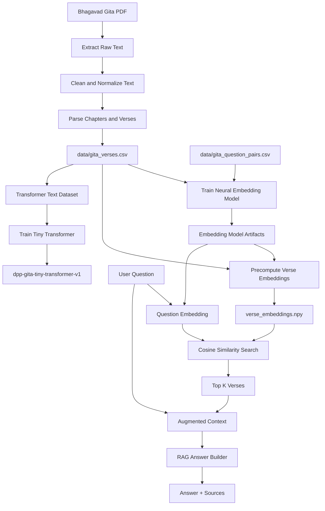

# 02 Gita AI Models

## Goal

Build Bhagavad Gita question-answering models from scratch.

The goal is to understand how a useful local assistant can be built without pretrained embeddings, without a pretrained LLM, and without external AI APIs.

This folder is the training and experimentation area for:

- PDF extraction
- Gita verse dataset creation
- TF-IDF baseline retrieval
- neural embedding retrieval from scratch
- RAG answer building
- tiny GPT-style transformer training from scratch
- experimental RAG plus transformer generation

## Project Rule

```text
No pretrained embedding model.
No pretrained LLM.
No external AI API.
No hosted vector database for v1.
```

The models here are intentionally small so the concepts are visible and the system can later run on a laptop or phone.

## Functionality

This folder can:

- extract text from the Bhagavad Gita PDF
- clean PDF text and normalize OCR/transliteration issues
- parse chapters, verses, translations, and commentaries
- build `data/gita_verses.csv`
- train a baseline TF-IDF search assistant
- train a neural embedding model from scratch
- precompute verse embeddings
- run cosine similarity search
- build source-backed RAG answers
- train a tiny transformer from scratch for next-token prediction
- run experimental RAG plus transformer answers
- evaluate retrieval quality
- expose models through the common API and registry

## Current Models

```text
dpp-gita-search-assistant-v1
  Baseline TF-IDF retrieval model.

dpp-gita-embedding-small-v1
  Neural embedding retrieval model trained from scratch.

dpp-gita-rag-assistant-v2
  RAG assistant using neural retrieval plus rule-based answer building.

dpp-gita-tiny-transformer-v1
  Tiny GPT-style transformer trained from scratch.

dpp-gita-rag-transformer-v1
  Experimental system combining retrieval with tiny transformer generation.
```

## Data Sources

PDF source:

```text
source_pdfs/bhagavad-gita-as-it-is.pdf
```

Generated files:

```text
data/extracted_raw_text.txt
data/gita_clean_text.txt
data/gita_verses.csv
data/gita_question_pairs.csv
```

Q&A training format:

```csv
question,answer,positive_chapter,positive_verse,topic
How can I control anger?,The Gita teaches sense control and tolerance of desire and anger.,5,23,anger
```

## Technical Details

### Text Normalization

The PDF contains English mixed with Sanskrit transliteration and OCR artifacts.

Examples:

```text
Bhagavad-gita variants -> Bhagavad Gita
Krsna variants -> Krishna
yoge variants -> yogi
gosvami variants -> gosvami
svami variants -> svami
jnana variants -> jnana
```

Rule:

```text
Normalize spelling and OCR noise.
Do not automatically translate Sanskrit meaning.
```

### TF-IDF Baseline

The baseline model uses word overlap.

Flow:

```text
question
-> tokenize
-> TF-IDF vector
-> cosine similarity
-> top verses
```

This gives a useful non-neural baseline.

### Neural Embedding Model

The embedding model is trained from scratch using the Q&A dataset.

Training idea:

```text
question should be close to the correct verse
question should be far from a negative verse
```

After training, the model stores:

```text
models/dpp-gita-embedding-small-v1/
  model.npz
  vocabulary.json
  verse_embeddings.npy
  verse_index.json
  config.json
  model_card.json
```

Where embeddings are stored:

```text
verse_embeddings.npy
```

How similarity search works:

```text
user question
-> token IDs
-> learned embedding vector
-> cosine similarity against verse_embeddings.npy
-> sort scores descending
-> return top K verses
```

### RAG

RAG means:

```text
R = Retrieval
A = Augmented context
G = Generation
```

In this project:

- Retrieval finds relevant verses.
- Augmented context packages verse text, translation, commentary, scores, and the user question.
- Generation builds a short answer from the retrieved sources.

The current useful RAG answer builder is rule-based, not a pretrained LLM.

### Tiny Transformer

The tiny transformer is a GPT-style learning model.

Its main learning purpose:

```text
predict the next token
```

Important concept:

```text
output layer size = vocabulary size
```

If the vocabulary has 200 tokens, the transformer scores 200 possible next tokens.

The transformer is small and experimental. It helps us learn:

- token embeddings
- positional embeddings
- self-attention
- feed-forward layers
- softmax over vocabulary
- next-token loss
- backpropagation through transformer components

## Architecture



## Folder Structure

```text
02_gita_ai_models/
  source_pdfs/
  data/
  models/
  scripts/
  src/
    embedding/
    rag/
    transformer/
  sdk/
  tests/
  train_gita_search_assistant.py
  train_gita_embedding_model.py
  train_gita_tiny_transformer.py
  ask_gita_rag.py
  ask_gita_transformer.py
  ask_gita_rag_transformer.py
  evaluate_gita_retrieval.py
  run_end_to_end.py
  complete_plan.md
```

## Requirements

Python dependencies include:

```text
numpy
PyMuPDF
```

Install:

```bash
cd /Users/debi.pradhan/Documents/ML/02_gita_ai_models
python3 -m pip install -r requirements.txt
```

If `requirements.txt` is not present in this folder, install the project-level dependencies used by the scripts:

```bash
python3 -m pip install numpy PyMuPDF
```

## How To Setup

1. Place the PDF here:

```text
source_pdfs/bhagavad-gita-as-it-is.pdf
```

2. Ensure the Q&A file exists:

```text
data/gita_question_pairs.csv
```

3. Install dependencies:

```bash
python3 -m pip install numpy PyMuPDF
```

## How To Execute

Run the end-to-end pipeline:

```bash
cd /Users/debi.pradhan/Documents/ML/02_gita_ai_models
python3 run_end_to_end.py
```

Train TF-IDF search:

```bash
python3 train_gita_search_assistant.py
```

Train neural embedding model:

```bash
python3 train_gita_embedding_model.py
```

Train tiny transformer:

```bash
python3 train_gita_tiny_transformer.py --max-texts 10 --max-vocab-size 200 --context-length 6 --d-model 10 --hidden-size 20 --epochs 2 --batch-size 8 --learning-rate 0.08
```

Ask the RAG assistant:

```bash
python3 ask_gita_rag.py "How can I control anger?"
```

Ask the embedding assistant:

```bash
python3 ask_gita_embedding.py "How can I control anger?"
```

Ask the tiny transformer:

```bash
python3 ask_gita_transformer.py "duty"
```

Ask the experimental RAG plus transformer system:

```bash
python3 ask_gita_rag_transformer.py "How can I control anger?"
```

Run tests:

```bash
python3 run_all_tests.py
```

## How Users Can Use It

For normal question answering, use:

```bash
python3 ask_gita_rag.py "How can I control anger?"
```

Expected output shape:

```text
answer
sources
chapter and verse references
similarity scores
```

For learning how the embedding model works, inspect:

```text
src/embedding/model.py
src/embedding/search.py
src/embedding/training_data.py
```

For learning transformer internals, inspect:

```text
src/transformer/model.py
src/transformer/train.py
src/transformer/generate.py
```

## Learning Notes

Important conclusions from this phase:

- A RAG assistant does not always need a large language model.
- Retrieval can be useful with a small neural embedding model.
- A transformer predicts the next token from its vocabulary.
- The transformer output layer size equals vocabulary size.
- For a useful assistant, retrieval quality often matters more than generation size.
- A tiny transformer trained from scratch is valuable for learning, but not yet good enough to replace RAG answer building.

## Current Limitations

- The PDF parser currently extracts about 698 verse rows from a roughly 700-verse source.
- Some grouped verses may share translation/commentary text.
- The tiny transformer is experimental and produces limited text quality.
- The RAG answer builder is rule-based, so its style is controlled but not deeply generative.
