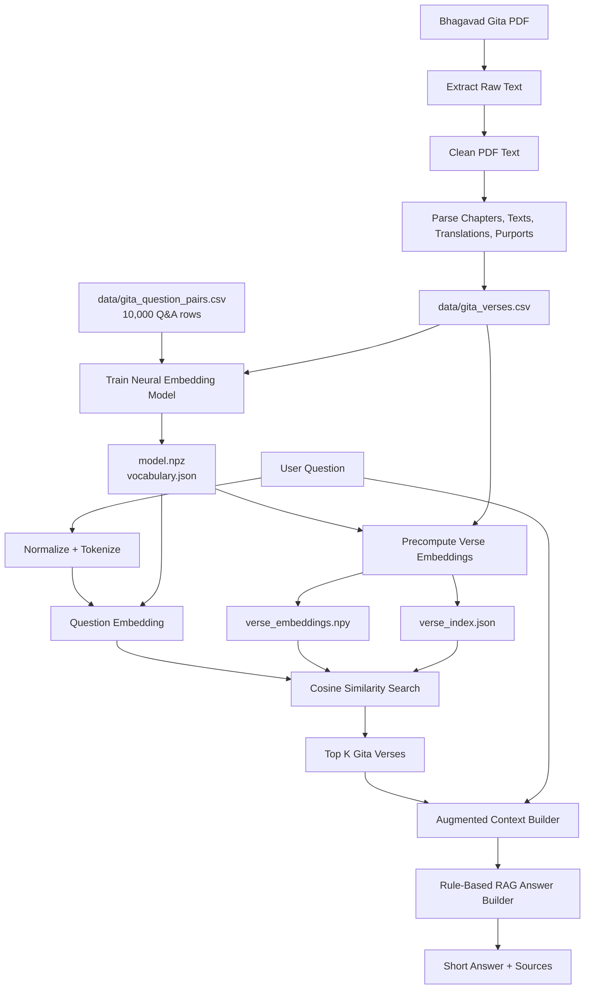
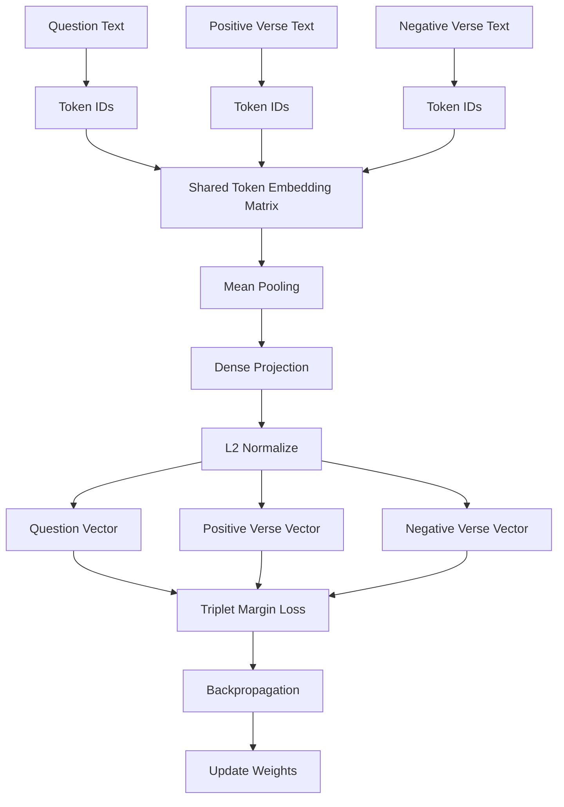
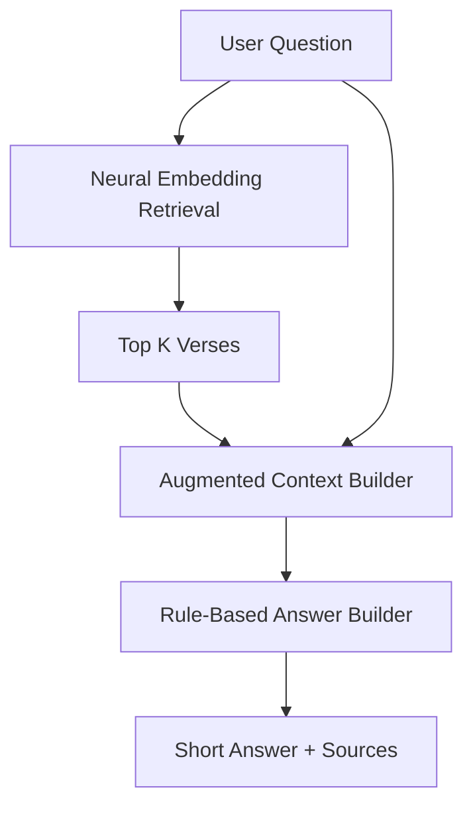

# Phase 2 Complete Plan: Bhagavad Gita Assistant From Scratch

## Goal

Build a complete Bhagavad Gita assistant that can run locally and later be packaged for laptop/mobile deployment.

Important rules:

```text
No pretrained embedding model.
No pretrained LLM.
No external AI API.
No vector database for v1.
```

Current assistant path:

```text
PDF source
-> structured Gita dataset
-> TF-IDF baseline retrieval
-> neural embedding retrieval from scratch
-> RAG assistant v2 with short source-backed answers
-> experimental RAG + tiny transformer assistant
-> common REST API
```

Later learning path:

```text
tiny transformer from scratch
-> next-token prediction
-> attention/backpropagation visualization
```

## Current Models

```text
1. dpp-gita-search-assistant-v1
   Baseline TF-IDF retrieval model.

2. dpp-gita-embedding-small-v1
   Neural embedding retrieval model trained from scratch.

3. dpp-gita-rag-assistant-v2
   Clean RAG assistant using neural embedding retrieval plus rule-based answer building.

4. dpp-gita-tiny-transformer-v1
   Tiny GPT-style transformer trained from scratch for next-token generation.

5. dpp-gita-rag-transformer-v1
   Experimental combined model: neural retrieval plus tiny transformer generation.
```

## End-To-End RAG Architecture



## RAG Meaning In This Project

## R: Retrieval

Retrieval finds the most relevant Gita verses for a user question.

Current retrieval options:

```text
TF-IDF retrieval:
dpp-gita-search-assistant-v1

Neural embedding retrieval:
dpp-gita-embedding-small-v1
```

Neural embedding retrieval flow:

```text
question
-> normalize text
-> token IDs
-> trained neural embedding model
-> 64-dimensional question vector
-> cosine similarity with verse_embeddings.npy
-> top K verses
```

## A: Augmented Context

Augmented context is not another model.

It is structured data passed to the answer builder:

```text
question
top retrieved verses
translations
commentaries/purports
scores
instruction
```

Example:

```text
Question:
How can I control anger?

Retrieved context:
1. Chapter 2, Verse 58
2. Chapter 5, Verse 23
3. Chapter 6, Verse 26
```

## G: Generation

For v2, generation is rule-based and from scratch.

It does not use a pretrained LLM.

Current answer builder:

```text
src/rag/answer_builder.py
```

It builds:

```text
short answer
daily-life explanation
related source references
source list with scores
```

Later, the tiny transformer can be explored as a generator, but it is not required for the current useful assistant.

## Source Data Pipeline

Source PDF:

```text
source_pdfs/bhagavad-gita-as-it-is.pdf
```

Pipeline:

```text
PDF
-> data/extracted_raw_text.txt
-> data/gita_clean_text.txt
-> data/gita_verses.csv
```

PDF extraction:

```text
scripts/extract_pdf_text.py
```

Dataset builder:

```text
scripts/build_gita_dataset.py
```

Dataset validator:

```text
scripts/validate_gita_dataset.py
```

Parser behavior:

```text
single verses: TEXT 23 -> verse 23
grouped verses: TEXTS 13-14 -> verse 13 and verse 14
grouped verses: TEXTS 1-3 -> verse 1, verse 2, verse 3
```

Current parsed dataset:

```text
PDF pages extracted: 952
Verse rows parsed: 698
Chapters found: 18
Missing translations: 0
Missing commentaries: 32
Duplicate chapter/verse rows: 0
```

Known source limitation:

```text
The Gita has about 700 verses.
This PDF parser currently extracts 698 rows.
Some grouped verses share the same translation/commentary because the PDF groups them together.
```

## Training Dataset

Q&A training file:

```text
data/gita_question_pairs.csv
```

Format:

```csv
question,answer,positive_chapter,positive_verse,topic
How can I control anger?,The Gita teaches sense control and tolerance of desire and anger.,5,23,anger
```

Current status:

```text
Rows: 10,000
Topics: 50
Rows matched to parsed verses: 10,000 / 10,000
Unmatched rows: 0
```

This dataset trains retrieval:

```text
question -> correct positive verse
question -> generated negative verse
```

## Text Normalization

The PDF contains English mixed with Sanskrit transliteration, diacritics, and OCR artifacts.

Examples:

```text
Bhagavad-gétä
Kåñëa
yogé
gosvämé
svämé
jïäna
```

We keep the source text, but normalize text for tokenization, search, embedding training, and answer display.

Normalization examples:

```text
Bhagavad-gétä -> Bhagavad Gita
Kåñëa -> Krishna
yogé -> yogi
gosvämé -> gosvami
svämé -> svami
jïäna -> jnana
```

Implemented in:

```text
src/text.py
src/dataset.py
src/answer_builder.py
src/retrieval.py
src/rag/context_builder.py
```

Rule:

```text
Normalize spelling and OCR noise.
Do not automatically translate Sanskrit meaning.
```

## Model 1: TF-IDF Baseline

Model:

```text
dpp-gita-search-assistant-v1
```

Purpose:

```text
Baseline retrieval using word overlap and TF-IDF.
```

Flow:

```text
question
-> tokenize
-> TF-IDF vector
-> cosine similarity with verse TF-IDF vectors
-> top K verses
```

Files:

```text
src/vocabulary.py
src/vectorize.py
src/retrieval.py
src/storage.py
train_gita_search_assistant.py
ask_gita.py
```

Artifacts:

```text
models/dpp-gita-search-assistant-v1/model_card.json
models/dpp-gita-search-assistant-v1/vocabulary.json
models/dpp-gita-search-assistant-v1/idf.json
models/dpp-gita-search-assistant-v1/verse_index.json
```

## Model 2: Neural Embedding Model

Model:

```text
dpp-gita-embedding-small-v1
```

Purpose:

```text
Learn semantic similarity from 10,000 Q&A pairs.
```

No pretrained model is used.

Architecture:



Architecture details:

```text
token embedding size: 32
final embedding size: 64
vocabulary size: 8,000
training rows: 10,000
loss: triplet margin loss
implementation: NumPy from scratch
```

Training idea:

```text
question embedding close to positive verse embedding
question embedding far from negative verse embedding
```

Files:

```text
src/embedding/vocabulary.py
src/embedding/training_data.py
src/embedding/model.py
src/embedding/storage.py
src/embedding/search.py
train_gita_embedding_model.py
ask_gita_embedding.py
evaluate_gita_retrieval.py
```

Artifacts:

```text
models/dpp-gita-embedding-small-v1/model.npz
models/dpp-gita-embedding-small-v1/vocabulary.json
models/dpp-gita-embedding-small-v1/verse_embeddings.npy
models/dpp-gita-embedding-small-v1/verse_index.json
models/dpp-gita-embedding-small-v1/config.json
models/dpp-gita-embedding-small-v1/model_card.json
```

Artifact meaning:

```text
model.npz              trained neural weights
vocabulary.json        token -> id mapping
verse_embeddings.npy   precomputed 64-dimensional vector per verse
verse_index.json       chapter/verse/translation/commentary for each embedding row
config.json            model dimensions and training settings
model_card.json        model metadata and proof pretrained_model_used=false
```

Current training result:

```text
Embedding final loss: 0.00020870480835437775
```

Current retrieval comparison on first 1,000 Q&A rows:

```text
TF-IDF top-1 accuracy: 0.002
TF-IDF top-3 accuracy: 0.003
TF-IDF top-5 accuracy: 0.019

Neural embedding top-1 accuracy: 0.772
Neural embedding top-3 accuracy: 0.928
Neural embedding top-5 accuracy: 0.961
```

## Where Embeddings Are Stored

Embeddings are stored locally as a file, not in a database.

```text
models/dpp-gita-embedding-small-v1/verse_embeddings.npy
```

Shape:

```text
698 verses x 64 dimensions
```

Row mapping:

```text
verse_embeddings.npy row N
-> verse_index.json row N
-> chapter, verse, translation, commentary
```

Why file-based storage:

```text
small dataset
offline friendly
portable
easy to copy
no DB server
good for laptop now
mobile-friendly later
```

Approximate embedding size:

```text
698 x 64 x float32
about 175 KB
```

## Similarity Search

Embedding search:

```text
question
-> normalize
-> token IDs using vocabulary.json
-> model.npz creates question embedding
-> load verse_embeddings.npy
-> cosine similarity against every verse vector
-> sort scores descending
-> return top K verses from verse_index.json
```

Cosine similarity means:

```text
similar direction = similar meaning
```

This lets the model match related wording.

Example:

```text
overthinking
restless mind
mental control
```

TF-IDF struggles with this if words do not overlap.  
The neural embedding model is trained to learn these relationships from Q&A pairs.

## Model 3: RAG Assistant v2

Model:

```text
dpp-gita-rag-assistant-v2
```

Purpose:

```text
Use neural embedding retrieval and produce a short, readable answer with sources.
```

Flow:



Files:

```text
src/rag/context_builder.py
src/rag/answer_builder.py
ask_gita_rag.py
tests/test_gita_rag_assistant.py
```

API support:

```text
POST /predict
POST /inspect-rag
```

Current answer style:

```text
short
source-backed
daily-life explanation
no long raw purport dump
```

Example command:

```bash
python3 ask_gita_rag.py "How can I control anger?"
```

Example output shape:

```text
Model: dpp-gita-rag-assistant-v2
Retriever: dpp-gita-embedding-small-v1
Question: How can I control anger?

Short answer...

Sources:
- Chapter 2, Verse 58 | score=...
- Chapter 5, Verse 23 | score=...
- Chapter 6, Verse 26 | score=...
```

## Tiny Transformer Plan

Model:

```text
dpp-gita-tiny-transformer-v1
```

Status:

```text
started
tokenizer and next-token dataset are built
single-head causal self-attention forward pass is built
cross-entropy training/backpropagation is built
text generation is built
API integration is not built yet
```

Purpose:

```text
Learn GPT-style transformer internals from scratch.
```

This model is for learning and experimentation first. It is not required for the current practical RAG assistant.

Important distinction:

```text
RAG assistant:
question -> retrieve trusted verses -> build source-backed answer

Tiny transformer:
previous tokens -> predict the next token
```

The tiny transformer will not replace the RAG assistant in v1. It will teach how GPT-like models work internally: token embeddings, positional embeddings, attention, logits, softmax, loss, and backpropagation.

Transformer learning flow:

```text
Gita text
-> tokenization
-> token IDs
-> token embeddings
-> positional embeddings
-> self-attention
-> feed-forward network
-> output logits
-> softmax over vocabulary
-> next-token prediction
-> cross-entropy loss
-> backpropagation
```

## Tiny Transformer Architecture

```mermaid
flowchart LR
    TXT["Training Text<br/>Gita verses + Q&A answers"] --> TOK["Word/Subword Tokenizer"]
    TOK --> VOC["Vocabulary Builder<br/>fixed token list"]
    VOC --> IDS["Token IDs<br/>training sequences"]
    IDS --> INP["Input Window<br/>example: 32 tokens"]
    INP --> EMB["Token Embedding<br/>vocab_size x d_model"]
    INP --> POS["Position Embedding<br/>context_length x d_model"]
    EMB --> SUM["Add Token + Position Vectors"]
    POS --> SUM
    SUM --> ATT["Causal Self-Attention<br/>Q, K, V"]
    ATT --> FFN["Feed Forward Network"]
    FFN --> LOGITS["Output Layer<br/>vocab_size logits"]
    LOGITS --> SM["Softmax<br/>next-token probabilities"]
    SM --> LOSS["Cross-Entropy Loss<br/>compare with next token"]
    LOSS --> BP["Backpropagation"]
    BP --> UPD["Update Weights"]
    UPD --> EMB
```



## Tiny Transformer Target Design

Initial small design:

```text
model_id: dpp-gita-tiny-transformer-v1
implementation: NumPy from scratch
task: next-token prediction
tokenizer: simple word/subword tokenizer built locally from Gita text
context length: 32 tokens
embedding size: 64 dimensions
attention heads: 2
transformer blocks: 1 or 2
feed-forward hidden size: 128
output neurons: vocab_size
loss: cross-entropy
optimizer: gradient descent / Adam-like optimizer from scratch
```

Why output neurons equal `vocab_size`:

```text
The transformer predicts one next token.
If vocabulary has 5,000 tokens, output layer has 5,000 scores.
Each score means: "how likely is this token next?"
```

For example:

```text
Input tokens:
"control anger by"

Output layer scores:
mind      0.18
practice  0.12
desire    0.08
...
```

The model picks or samples the next token, then repeats the same process to generate more text.

## Tiny Transformer Training Data

We will use only local project data:

```text
1. data/gita_verses.csv
   translations and cleaned commentary text

2. data/gita_question_pairs.csv
   question and answer text
```

No pretrained model and no external AI API will be used.

Training examples will be created like this:

```text
Text:
"control anger by steady practice"

Training windows:
input:  control
target: anger

input:  control anger
target: by

input:  control anger by
target: steady
```

For batching, each input will be padded or clipped to the fixed context length.

## Tiny Transformer Files To Build

Planned files:

```text
src/transformer/tokenizer.py
  builds vocabulary and converts text <-> token IDs

src/transformer/dataset.py
  creates next-token training examples

src/transformer/model.py
  token embeddings, positional embeddings, attention, FFN, output logits

src/transformer/train.py
  training loop, loss, backpropagation, weight updates

src/transformer/storage.py
  saves and loads model.npz, vocabulary.json, config.json, model_card.json

src/transformer/generate.py
  generate tokens from a prompt

train_gita_tiny_transformer.py
  command-line training entrypoint

ask_gita_transformer.py
  command-line prompt/generation entrypoint

tests/test_gita_tiny_transformer.py
  tokenizer, shape, forward pass, and tiny overfit tests

models/dpp-gita-tiny-transformer-v1/
  model.npz
  vocabulary.json
  config.json
  model_card.json
```

## Tiny Transformer Execution Plan

```text
Step 1: Build tokenizer and vocabulary from local Gita/Q&A text.
Step 2: Build next-token dataset from token windows.
Step 3: Implement forward pass with shapes visible at every step.
Step 4: Implement cross-entropy loss.
Step 5: Implement backpropagation and weight updates.
Step 6: Train tiny model on a small sample first.
Step 7: Prove it can overfit a tiny text sample.
Step 8: Train on full local Gita/Q&A text.
Step 9: Save model artifacts under models/dpp-gita-tiny-transformer-v1.
Step 10: Add ask_gita_transformer.py for simple generation.
Step 11: Add API support after command-line model works.
Step 12: Add visualizer support for attention and next-token flow.
```

Success criteria:

```text
1. No pretrained model used.
2. Forward pass returns logits shaped 1 x context_length x vocab_size.
3. Loss decreases during training.
4. Tiny overfit test passes on a small sentence.
5. Saved model can reload and generate text.
6. The visualizer can inspect tokenization, embeddings, attention, logits, softmax, loss, and backpropagation.
```

Why later:

```text
RAG assistant = useful product path
tiny transformer = learning GPT internals path
```

## Folder Structure

```text
02_gita_ai_models/
  complete_plan.md
  ask_gita.py
  ask_gita_embedding.py
  ask_gita_rag.py
  evaluate_gita_retrieval.py
  run_all_tests.py
  run_end_to_end.py
  train_gita_search_assistant.py
  train_gita_embedding_model.py

  source_pdfs/
    bhagavad-gita-as-it-is.pdf

  data/
    extracted_raw_text.txt
    gita_clean_text.txt
    gita_verses.csv
    gita_question_pairs.csv

  scripts/
    extract_pdf_text.py
    build_gita_dataset.py
    validate_gita_dataset.py

  src/
    text.py
    dataset.py
    vocabulary.py
    vectorize.py
    retrieval.py
    storage.py
    answer_builder.py
    embedding/
    rag/

  models/
    dpp-gita-search-assistant-v1/
    dpp-gita-embedding-small-v1/

  sdk/
    gita_assistant.py

  tests/
    test_gita_search_assistant.py
    test_gita_embedding_model.py
    test_gita_rag_assistant.py

../common_model_api/
  app.py
  tests/test_app.py

../model_registry/
  registry.json
```

## How To Run

Run tests:

```bash
cd /Users/debi.pradhan/Documents/ML/02_gita_ai_models
python3 run_all_tests.py
```

Rebuild PDF dataset and baseline model:

```bash
cd /Users/debi.pradhan/Documents/ML/02_gita_ai_models
python3 run_end_to_end.py
```

Train TF-IDF baseline only:

```bash
cd /Users/debi.pradhan/Documents/ML/02_gita_ai_models
python3 train_gita_search_assistant.py
```

Ask TF-IDF baseline:

```bash
cd /Users/debi.pradhan/Documents/ML/02_gita_ai_models
python3 ask_gita.py "How can I control anger?"
```

Train neural embedding model:

```bash
cd /Users/debi.pradhan/Documents/ML/02_gita_ai_models
python3 train_gita_embedding_model.py
```

Ask neural embedding retrieval model:

```bash
cd /Users/debi.pradhan/Documents/ML/02_gita_ai_models
python3 ask_gita_embedding.py "How can I control anger?"
```

Ask clean RAG assistant:

```bash
cd /Users/debi.pradhan/Documents/ML/02_gita_ai_models
python3 ask_gita_rag.py "How can I control anger?"
```

Train tiny transformer smoke model:

```bash
cd /Users/debi.pradhan/Documents/ML/02_gita_ai_models
python3 train_gita_tiny_transformer.py \
  --max-texts 10 \
  --max-vocab-size 200 \
  --context-length 6 \
  --d-model 10 \
  --hidden-size 20 \
  --epochs 2 \
  --batch-size 8 \
  --learning-rate 0.08
```

Train larger tiny transformer:

```bash
cd /Users/debi.pradhan/Documents/ML/02_gita_ai_models
python3 train_gita_tiny_transformer.py
```

Ask tiny transformer:

```bash
cd /Users/debi.pradhan/Documents/ML/02_gita_ai_models
python3 ask_gita_transformer.py "the soul" --max-new-tokens 8 --show-steps
```

Ask tiny transformer with sampling:

```bash
cd /Users/debi.pradhan/Documents/ML/02_gita_ai_models
python3 ask_gita_transformer.py "control anger" --max-new-tokens 20 --temperature 0.8 --show-steps
```

Start common API:

```bash
cd /Users/debi.pradhan/Documents/ML/common_model_api
uvicorn app:app --reload --port 8010
```

Call RAG through API:

```bash
curl -X POST http://127.0.0.1:8010/predict \
  -H "Content-Type: application/json" \
  -d '{"model_id":"dpp-gita-rag-assistant-v2","input":"How can I control anger?"}'
```

Inspect RAG through API:

```bash
curl -X POST http://127.0.0.1:8010/inspect-rag \
  -H "Content-Type: application/json" \
  -d '{"model_id":"dpp-gita-rag-assistant-v2","input":"How can I control anger?"}'
```

Call tiny transformer through API:

```bash
curl -X POST http://127.0.0.1:8010/predict \
  -H "Content-Type: application/json" \
  -d '{"model_id":"dpp-gita-tiny-transformer-v1","input":"control anger"}'
```

Inspect tiny transformer through API:

```bash
curl -X POST http://127.0.0.1:8010/inspect-transformer \
  -H "Content-Type: application/json" \
  -d '{"model_id":"dpp-gita-tiny-transformer-v1","input":"control anger"}'
```

Ask experimental RAG + transformer assistant:

```bash
cd /Users/debi.pradhan/Documents/ML/02_gita_ai_models
python3 ask_gita_rag_transformer.py "How can I control anger?" --max-new-tokens 20 --show-steps
```

Call RAG + transformer through API:

```bash
curl -X POST http://127.0.0.1:8010/predict \
  -H "Content-Type: application/json" \
  -d '{"model_id":"dpp-gita-rag-transformer-v1","input":"How can I control anger?"}'
```

Inspect RAG + transformer through API:

```bash
curl -X POST http://127.0.0.1:8010/inspect-rag-transformer \
  -H "Content-Type: application/json" \
  -d '{"model_id":"dpp-gita-rag-transformer-v1","input":"How can I control anger?"}'
```

Compare TF-IDF and neural embedding retrieval:

```bash
cd /Users/debi.pradhan/Documents/ML/02_gita_ai_models
python3 evaluate_gita_retrieval.py --limit 1000
```

## Current Verification

Latest verified checks:

```text
Phase 2 tests: 34 passed
Tiny transformer tests: 16 passed
Model API tests: 11 passed
PDF pages: 952
Parsed verse rows: 698
Q&A rows matched: 10,000 / 10,000
No pretrained model used
RAG answer works
RAG API works
Tiny transformer API works
RAG + tiny transformer experimental integration works
Visualizer UI supports email, RAG, transformer, and RAG + transformer flows
Transformer generation supports top-k sampling and common-token suppression
Tiny transformer trained with 100 balanced texts, 1,000 vocabulary tokens, context length 16
Tiny transformer loss: 6.002470 -> 5.253488
```

Test command:

```bash
python3 run_all_tests.py
```

RAG command:

```bash
python3 ask_gita_rag.py "How can I control anger?"
```

## Current Limitations

```text
1. Answer builder is rule-based, not a generative transformer.
2. Some grouped verses share translation/commentary because the PDF groups them.
3. The neural embedding model is small and trained only on the provided 10k Q&A pairs.
4. Visualizer UI is integrated, but it still needs deeper visual polish.
5. Tiny transformer generation supports top-k and common-token suppression, but still repeats because the model is tiny.
6. RAG + tiny transformer integration is experimental; current tiny transformer output is not yet answer-quality.
```

## Recommended Next Steps

```text
1. Plan Marg app as the user-facing product.
2. Choose first Marg shell: Mac app, Chrome extension, Android app, or local web app.
3. Keep dpp-gita-rag-assistant-v2 as the reliable answer engine for Marg v1.
4. Keep dpp-gita-rag-transformer-v1 as an experimental learning mode.
5. Improve tiny transformer training quality before relying on generated answers.
```
