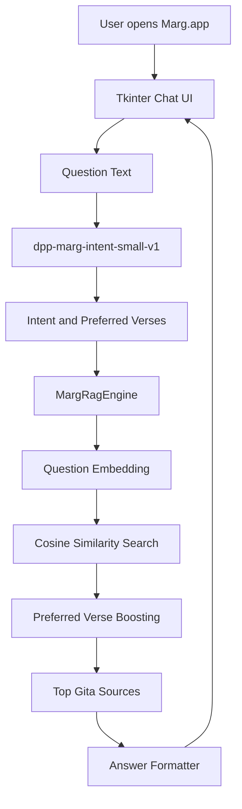

# Marg Offline Assistant

## Goal

Build Marg, a fully offline Bhagavad Gita desktop assistant for macOS.

The app should work like a small local product:

```text
install app
open from Applications
ask a question
get an answer from the packaged local model
```

The user should not need Python, command-line setup, cloud APIs, or internet access after installation.

## Product Name

```text
Marg
```

Meaning:

```text
path / direction / guidance
```

## Functionality

Marg can:

- run as a macOS desktop app
- answer Bhagavad Gita questions offline
- retrieve relevant verses from packaged local embeddings
- use a small local intent model for question routing
- use `preferred_verses` from training CSVs to improve retrieval
- format answers in a simple chat UI
- start a fresh chat
- run terminal self-tests
- build a standalone `.app`
- build a `.pkg` installer

## Important Product Rule

```text
No internet.
No cloud.
No external AI API.
No pretrained hosted model.
No runtime dependency on training folders.
```

The installed app packages everything it needs.

## Current Packaged Models

### Main RAG Model

```text
models/dpp-gita-rag-assistant-v2/
  model.npz
  vocabulary.json
  verse_embeddings.npy
  verse_index.json
  config.json
  model_card.json
```

### Intent Model

```text
models/dpp-marg-intent-small-v1/
  model.npz
  vocabulary.json
  intents.json
  intent_verse_preferences.json
  model_card.json
```

The intent model uses the training CSVs in `data/`:

```text
marg_intent_questions.csv
marg_intent_questions_hard_10k.csv
marg_intent_verses_20k.csv
```

`intent_verse_preferences.json` is generated from the CSV `preferred_verses` column. It helps retrieval choose better verse families for questions like:

```text
who is Krishna?
am I god?
what is atma and paramatma?
how to manage ego?
```

## Technical Details

### Runtime Flow

```text
user question
-> intent model
-> optional core Gita routing
-> question expansion
-> neural embedding search
-> ranked preferred verse boosting
-> top verses
-> source-backed answer builder
-> chat UI response
```

### UI

The app uses Tkinter.

Current UI direction:

```text
Focused Chat UI
off-white background
Marg logo/header
message cards
custom flat Ask/New Chat buttons
local status text
```

### Packaging

Packaging uses PyInstaller.

The standalone app bundles:

- Python runtime
- NumPy
- Tkinter support
- backend code
- model artifacts
- app icon

## Architecture



## Folder Structure

```text
03_marg_offline_assistant/
  run_marg_desktop.py
  ask_marg.py
  train_marg_intent_model.py
  requirements.txt
  backend/
    intent_model.py
    rag_engine.py
    model_loader.py
    paths.py
    text.py
  data/
    marg_intent_questions.csv
    marg_intent_questions_hard_10k.csv
    marg_intent_verses_20k.csv
  models/
    dpp-gita-rag-assistant-v2/
    dpp-marg-intent-small-v1/
  assets/
  scripts/
    build_marg_app.py
    create_marg_icon.py
  tests/
  dist_user/
```

## Requirements

For development:

```text
Python 3.11+
numpy
pyinstaller
```

Install:

```bash
cd /Users/debi.pradhan/Documents/ML/03_marg_offline_assistant
python3 -m pip install -r requirements.txt
```

For end users installing the packaged app:

```text
No Python install required.
No pip install required.
No internet required.
```

## How To Setup

Development setup:

```bash
cd /Users/debi.pradhan/Documents/ML/03_marg_offline_assistant
python3 -m pip install -r requirements.txt
```

Verify local model loading:

```bash
python3 run_marg_desktop.py --self-test
```

## How To Execute

Run the desktop app from source:

```bash
cd /Users/debi.pradhan/Documents/ML/03_marg_offline_assistant
python3 run_marg_desktop.py
```

Ask from terminal:

```bash
python3 ask_marg.py "How can I control anger?"
```

Train the Marg intent model:

```bash
python3 train_marg_intent_model.py
```

Run tests:

```bash
python3 -m unittest discover -s tests
python3 tests/ui_click_smoke.py
```

Build app and installer:

```bash
python3 scripts/build_marg_app.py --pkg --install-scope user --output-dir dist_user
```

Outputs:

```text
dist_user/Marg.app
dist_user/Marg.pkg
```

Install for current user:

```bash
ditto dist_user/Marg.app /Users/debi.pradhan/Applications/Marg.app
```

## How Users Can Use It

1. Install `Marg.pkg`.
2. Open `Marg` from Applications.
3. Type a Bhagavad Gita question.
4. Click `Ask`.
5. Read the answer and reference.
6. Click `New chat` to reset the conversation.

Example questions:

```text
How can I control anger?
How to manage ego?
Who is Krishna?
Am I god?
What is atma and paramatma?
How should I do my duty?
How can I manage money?
```

## Verification

Run:

```bash
python3 -m unittest discover -s tests
python3 tests/ui_click_smoke.py
/Users/debi.pradhan/Applications/Marg.app/Contents/MacOS/Marg --self-test
```

Expected:

```text
tests pass
UI click smoke OK
Marg self-test OK
```

## Learning Notes

This app taught several product-level lessons:

- A trained model becomes usable only after weights, vocabulary, and config are saved.
- A desktop app should not depend on the training folder at runtime.
- Retrieval quality improves when user intent and preferred verses guide search.
- UI must be tested with repeated clicks, not just first-load screenshots.
- Packaging must be verified from the installed app, not only from source.

## Current Limitations

- Answer generation is controlled and source-backed, not a large generative LLM.
- The intent model is small and uses a hybrid of neural predictions plus core routing.
- The UI is intentionally simple and offline-first.
- More real user questions will improve routing and preferred verse coverage.
