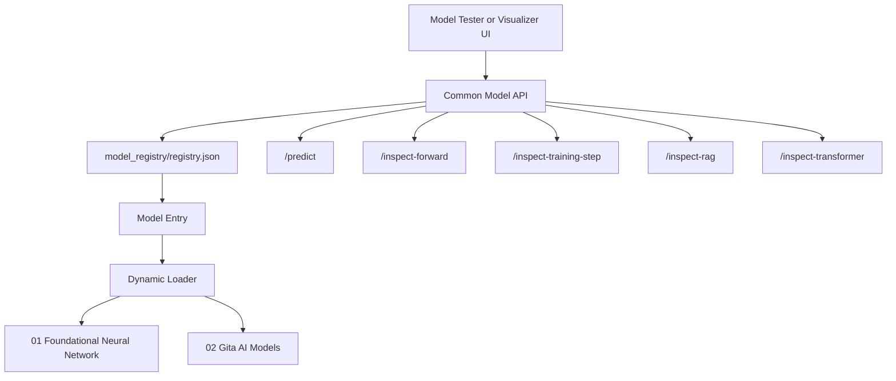

# Common Model API

## Goal

Provide one REST API for all local models in this workspace.

Instead of every model having its own server, this API reads `model_registry/registry.json`, loads the selected model, and exposes common endpoints for prediction and inspection.

## Functionality

The API can:

- list registered models
- load a model by `model_id`
- run prediction
- inspect a Phase 1 forward pass
- inspect a Phase 1 training step
- inspect Gita RAG retrieval
- inspect tiny transformer generation
- inspect experimental RAG plus transformer flow

## Technical Details

Framework:

```text
FastAPI
Pydantic
Uvicorn
```

Registry path:

```text
../model_registry/registry.json
```

Supported model families:

```text
email_classifier_from_scratch
gita_rag_assistant_from_scratch
gita_tiny_transformer_from_scratch
gita_rag_transformer_from_scratch
```

## Architecture



## Endpoints

```text
GET /health
GET /models
POST /predict
POST /inspect-forward
POST /inspect-training-step
POST /inspect-rag
POST /inspect-transformer
POST /inspect-rag-transformer
```

## Requirements

Install:

```bash
cd /Users/debi.pradhan/Documents/ML/common_model_api
python3 -m pip install -r requirements.txt
```

Typical dependencies:

```text
fastapi
uvicorn
pydantic
numpy
```

## How To Setup

Make sure model artifacts exist in:

```text
../01_foundational_neural_network/models/
../02_gita_ai_models/models/
```

Make sure the registry exists:

```text
../model_registry/registry.json
```

Install requirements:

```bash
python3 -m pip install -r requirements.txt
```

## How To Execute

Start the API:

```bash
cd /Users/debi.pradhan/Documents/ML/common_model_api
uvicorn app:app --reload --port 8010
```

Health check:

```bash
curl http://127.0.0.1:8010/health
```

List models:

```bash
curl http://127.0.0.1:8010/models
```

Predict:

```bash
curl -X POST http://127.0.0.1:8010/predict \
  -H "Content-Type: application/json" \
  -d '{"model_id":"dpp-email-classifier-small-v1","input":"Can we review the deadline tomorrow?"}'
```

Run API tests:

```bash
python3 run_api_tests.py
python3 -m unittest discover -s tests
```

## How Users Can Use It

Users do not usually call this API directly unless they are testing models.

The intended consumers are:

- `model_testing_ui`
- `model_flow_visualizer`
- future apps that need a local model server

For direct usage:

1. Start the API on port `8010`.
2. Call `/models`.
3. Choose a `model_id`.
4. Send text to `/predict`.
5. Use inspect endpoints for learning and debugging.

## Learning Notes

This API teaches how a trained model becomes a service:

```text
model artifact
-> registry metadata
-> loader
-> common request schema
-> prediction response
```

The same model can be used from:

- command line
- SDK
- REST API
- browser UI
- desktop app

## Current Limitations

- It is a local development API, not hardened for production.
- It uses dynamic imports because each phase has its own source layout.
- Registry paths must stay updated when folders are renamed.
