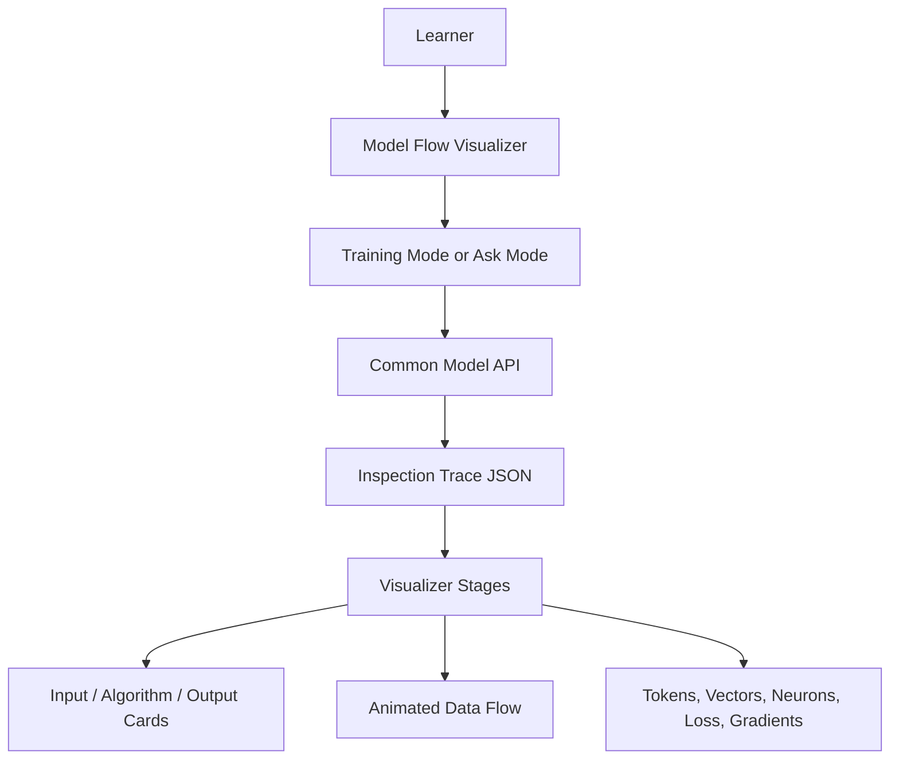

# Model Flow Visualizer

## Goal

Create a common learning UI that shows what happens inside a model step by step.

This visualizer is not only for prediction. It is for transparency:

```text
What data entered this step?
What algorithm ran?
What shape came out?
What values changed?
How did the model learn?
```

## Functionality

The visualizer can show:

- model selection
- Training Mode
- Ask Mode
- tokenization
- vocabulary lookup
- vectorization
- forward propagation
- hidden neuron values
- ReLU activation
- output scores
- softmax probabilities
- loss calculation
- backpropagation
- weight update preview
- RAG retrieval traces
- transformer token/generation traces
- cinematic playback controls

Playback controls:

```text
Previous
Play
Pause
Next
Replay
Speed
```

## Technical Details

This is a static browser UI:

```text
HTML
CSS
JavaScript
```

It calls the common API:

```text
http://127.0.0.1:8010
```

Default UI server:

```text
http://127.0.0.1:8020
```

## Architecture



## Visualized Phase 1 Flow

```text
Input Message
-> Word Tokenization
-> Vocabulary Lookup
-> Bag-of-Words Vectorization
-> Hidden Layer 1
-> ReLU Activation
-> Output Layer 2
-> Softmax Probabilities
-> Prediction
-> Loss Calculation
-> Backpropagation
-> Weight Update
```

Training Mode shows loss/backpropagation.

Ask Mode shows forward pass and prediction only.

## Folder Structure

```text
model_flow_visualizer/
  index.html
  style.css
  app.js
  serve_ui.py
  visualizer_smoke_test.js
```

## Requirements

For serving:

```text
Python 3
```

For smoke testing:

```text
Node.js
```

The UI also requires the common API to be running for live model data.

## How To Setup

Start the API first:

```bash
cd /Users/debi.pradhan/Documents/ML/common_model_api
uvicorn app:app --reload --port 8010
```

Start the visualizer:

```bash
cd /Users/debi.pradhan/Documents/ML/model_flow_visualizer
python3 serve_ui.py
```

Open:

```text
http://127.0.0.1:8020
```

## How To Execute

Run smoke test:

```bash
cd /Users/debi.pradhan/Documents/ML/model_flow_visualizer
node visualizer_smoke_test.js
```

## How Users Can Use It

1. Start `common_model_api`.
2. Start `model_flow_visualizer`.
3. Open `http://127.0.0.1:8020`.
4. Select a model.
5. Choose Training Mode or Ask Mode.
6. Use playback controls to inspect each stage.
7. Pause at any layer to see input, algorithm, and output.

## Learning Notes

This visualizer was created because theory alone is not enough.

The goal is to make the invisible visible:

- tokens should be visible
- vectors should be visible
- neuron values should be visible
- softmax should be visible
- gradients should be visible
- weight updates should be visible

## Current Limitations

- Phase 1 inspection is the most complete.
- Gita and transformer traces are present but can be made richer.
- The cinematic flow is still a learning UI, not a production dashboard.
