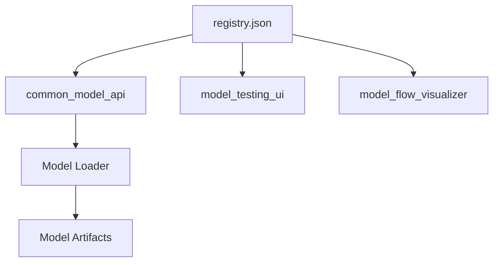

# Model Registry

## Goal

Provide a single catalog of all local models in the workspace.

The registry lets shared tools discover models without hardcoding every path in the UI or API.

## Functionality

The registry stores:

- model ID
- phase number
- model type
- artifact path
- supported operations
- retriever/generator relationships for composed models

## Main File

```text
registry.json
```

## Current Registered Models

```text
dpp-email-classifier-small-v1
dpp-gita-search-assistant-v1
dpp-gita-embedding-small-v1
dpp-gita-rag-assistant-v2
dpp-gita-tiny-transformer-v1
dpp-gita-rag-transformer-v1
```

## Technical Details

Each model entry has this style:

```json
{
  "model_id": "dpp-email-classifier-small-v1",
  "phase": 1,
  "type": "email_classifier_from_scratch",
  "path": "../01_foundational_neural_network/models/dpp-email-classifier-small-v1",
  "supports": ["predict", "inspect_forward", "inspect_training_step"]
}
```

The `type` field decides which loader the common API uses.

The `supports` field decides which UI actions are available.

## Architecture



## Requirements

No Python package is required for this folder.

It is plain JSON.

## How To Setup

Keep `registry.json` valid JSON.

Check it with:

```bash
cd /Users/debi.pradhan/Documents/ML/model_registry
python3 -m json.tool registry.json
```

## How To Execute

This folder does not execute by itself.

It is consumed by:

```text
common_model_api/app.py
model_flow_visualizer/app.js
model_testing_ui
```

## How Users Can Use It

To add a model:

1. Train/export model artifacts.
2. Add a new JSON entry.
3. Set `model_id`, `type`, `path`, and `supports`.
4. Restart the common API.
5. Confirm the model appears in `/models`.

## Learning Notes

This introduces the idea of a local model catalog.

Instead of saying:

```text
load this hardcoded folder
```

we say:

```text
load this model_id from the registry
```

That is how systems move from experiments to reusable platforms.

## Current Limitations

- Registry validation is manual.
- No semantic version enforcement yet.
- Paths are relative and must be updated after folder renames.
