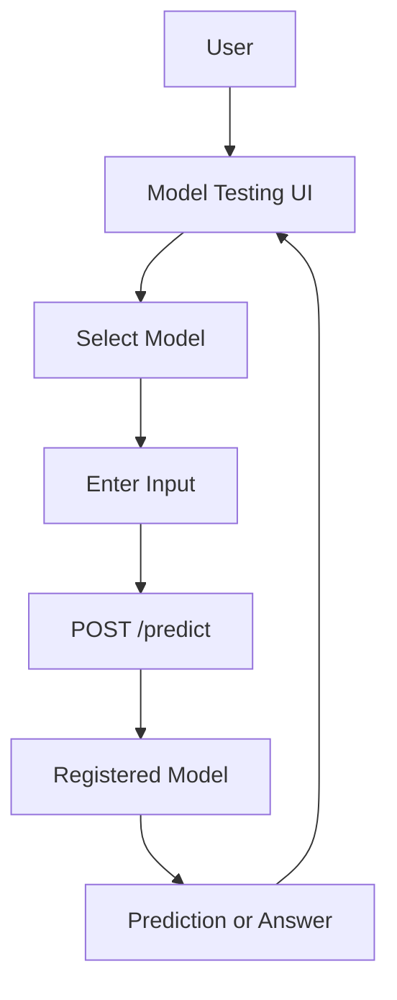

# Model Testing UI

## Goal

Provide a simple common UI for testing model predictions.

This is different from `model_flow_visualizer`.

```text
model_testing_ui = quick user testing
model_flow_visualizer = internal learning and inspection
```

## Functionality

Planned functionality:

- select a model from the registry
- enter input text
- call the common API
- show prediction
- show confidence or answer
- show model metadata
- support multiple model types through one UI

## Technical Details

This folder is currently a placeholder for the common model testing app.

Expected stack:

```text
HTML/CSS/JavaScript
or a lightweight local frontend
```

Expected backend:

```text
common_model_api
```

## Architecture



## Requirements

No active dependency yet.

When implemented, it will require:

```text
browser
common_model_api running locally
```

## How To Setup

Current setup:

```text
No setup yet.
```

Future setup:

```bash
cd /Users/debi.pradhan/Documents/ML/common_model_api
uvicorn app:app --reload --port 8010
```

Then open the testing UI.

## How To Execute

Current folder only contains:

```text
.gitkeep
```

Implementation is planned.

## How Users Can Use It

Once built:

1. Start the common API.
2. Open the testing UI.
3. Select model.
4. Enter input.
5. Click predict.
6. Review model output.

## Learning Notes

This UI exists because not every test needs full internal visualization.

Sometimes we only need:

```text
input -> output
```

The visualizer is for understanding. The tester is for product-style validation.

## Current Limitations

- Not implemented yet.
- The folder is reserved so the repo structure stays stable.
