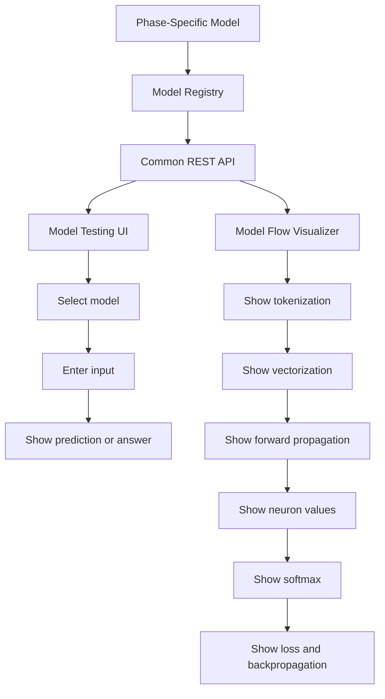

# Common Model Platform

## Mission

Build local models that are transparent enough for people to see what is happening inside.

Most people learn neural networks only as theory:

```text
tokenization -> vectorization -> forward propagation -> loss -> backpropagation
```

This platform makes those steps visible.

## Common Folder Structure

```text
ML/
  01_foundational_neural_network/
  02_gita_ai_models/
  03_marg_offline_assistant/
  model_registry/
  common_model_api/
  model_flow_visualizer/
  model_testing_ui/
  project_docs/
```

## Common Flow



## Local URLs

```text
Common API: http://127.0.0.1:8010
Model Flow Visualizer: http://127.0.0.1:8020
```

## API Command

```bash
cd /Users/debi.pradhan/Documents/ML/common_model_api
uvicorn app:app --reload --port 8010
```

## Visualizer Command

```bash
cd /Users/debi.pradhan/Documents/ML/model_flow_visualizer
python3 serve_ui.py
```

## Model Registry Example

```json
{
  "model_id": "dpp-email-classifier-small-v1",
  "phase": 1,
  "type": "email_classifier_from_scratch",
  "path": "../01_foundational_neural_network/models/dpp-email-classifier-small-v1",
  "supports": ["predict", "inspect_forward", "inspect_training_step"]
}
```

## Design Principle

Every model should expose:

```text
predict
inspect forward pass
inspect training step if trainable in the UI
metadata/model card
```

This lets one platform support multiple learning phases.
